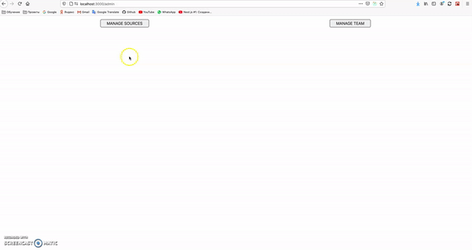
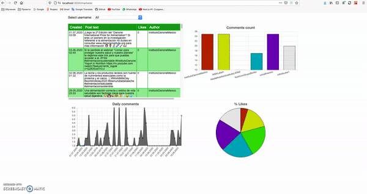

# Social React Test App

Screens:
  - http://localhost:3000/admin - Manage sources
  - http://localhost:3000/blank - Manage team (blank page)
  - http://localhost:3000/marketer - Post, comments, likes analysis

## Scripts to get started

To start project, use the following command:

```
yarn install
yarn start
```
Open [http://localhost:3000](http://localhost:3000) to view result in the browser.

## Used API

52.175.201.248:3000/facebook/facebook_post_comments/1
52.175.201.248:3000/facebook/facebook_post/1
52.175.201.248:3000/facebook/facebook_comments/1

## Description

A test application with React and Chart.js that allows to manage sources (Facebook, Twitter, Youtube, Reddit) and to see charts with posts comments likes.

## Demo


